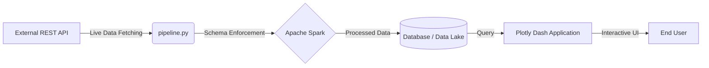

# Spark Data Dashboard

An end-to-end, real-time data engineering and visualization platform. This project demonstrates the ability to ingest live external API data, process it using distributed computing (Apache Spark), and serve it via an interactive Plotly Dash visualization layer.

## System Architecture



## Key Features
*   **Resilient API Ingestion:** Built-in error handling and timeouts for external API unreliability via `pipeline.py`.
*   **Distributed Processing Engine:** Uses PySpark for data schema enforcement, casting, and transformation.
*   **Interactive Visualization:** A Plotly Dash frontend providing real-time operational insights based on the ingested data.

## Quick Start

### 1. Install Dependencies
```bash
pip install -r requirements.txt
```

### 2. Start the Live Data Ingestion
Run the pipeline to begin fetching and processing data into the local database:
```bash
python pipeline.py
```

### 3. Launch the Dashboard
In a separate terminal, start the visualization server:
```bash
python app.py
```
Navigate to `http://localhost:8050` in your browser.

## Known Limitations

- **Java 11 required** — PySpark 3.5.x uses `javax.security.auth.Subject.getSubject()` which was removed in Java 21. Always run with Java 11.
- **Local mode only** — Runs Spark in `local[*]` mode; not configured for a cluster.

## License

MIT License — see LICENSE for details.
