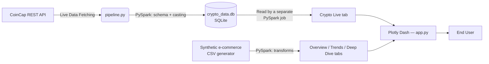

# Spark Data Dashboard

A data engineering and visualization project with two parts that now actually talk to each other:

1. **`pipeline.py`** — a standalone process that polls the CoinCap crypto API, processes each batch with its own PySpark job, and writes the results to a local SQLite table (`crypto_metrics` in `crypto_data.db`).
2. **`app.py`** — a Plotly Dash dashboard. Three of its four tabs (Overview, Trends, Deep Dive) visualize **synthetic e-commerce data** generated locally on first run. The fourth tab, **Crypto Live**, reads `pipeline.py`'s SQLite output through its own Spark job and renders it — this is the actual connection between the two components.

## System Architecture



## Key Features
*   **Resilient API Ingestion:** Built-in error handling and timeouts for external API unreliability via `pipeline.py`.
*   **Distributed Processing Engine:** Uses PySpark for data schema enforcement, casting, and transformation in both `pipeline.py` and `app.py`.
*   **Interactive Visualization:** A Plotly Dash frontend with four tabs — three over synthetic e-commerce data, one (Crypto Live) over real, live-polled data.
*   **Graceful degradation:** the Crypto Live tab shows a friendly empty state, not a crash, if `pipeline.py` hasn't been started yet.

## Quick Start

### 1. Install Dependencies
```bash
pip install -r requirements.txt
```

### 2. (Optional but recommended) Start the Live Data Ingestion
In one terminal, run the pipeline to begin fetching and processing live crypto data:
```bash
python pipeline.py
```
This writes to `crypto_data.db` in the repo root as it runs. You can also run it once with `python pipeline.py --test` to populate a single batch and exit.

### 3. Launch the Dashboard
In a separate terminal, start the visualization server:
```bash
python app.py
```
Navigate to `http://localhost:8050` in your browser. The Overview / Trends / Deep Dive tabs work immediately using generated synthetic data. The **Crypto Live** tab will show a message asking you to run `pipeline.py` until that process has written its first batch — after that, switching to the tab (or re-clicking it) re-reads the SQLite table and shows current data.

## Known Limitations

- **Java 11 required** — PySpark 3.5.x uses `javax.security.auth.Subject.getSubject()` which was removed in Java 21. Always run with Java 11.
- **Local mode only** — Runs Spark in `local[*]` mode; not configured for a cluster.
- **"Resilient" ingestion** means graceful HTTP error handling and timeouts in `pipeline.py`, not distributed fault tolerance or retry-with-backoff — it doesn't have that yet.
- **The e-commerce data is synthetic**, generated locally on first run — only the Crypto Live tab reflects real, live-polled data.
- **No auto-refresh:** the Crypto Live tab re-queries SQLite when you switch tabs, not on a timer. Re-clicking the tab is currently how you "refresh" it.

## License

MIT License — see LICENSE for details.
